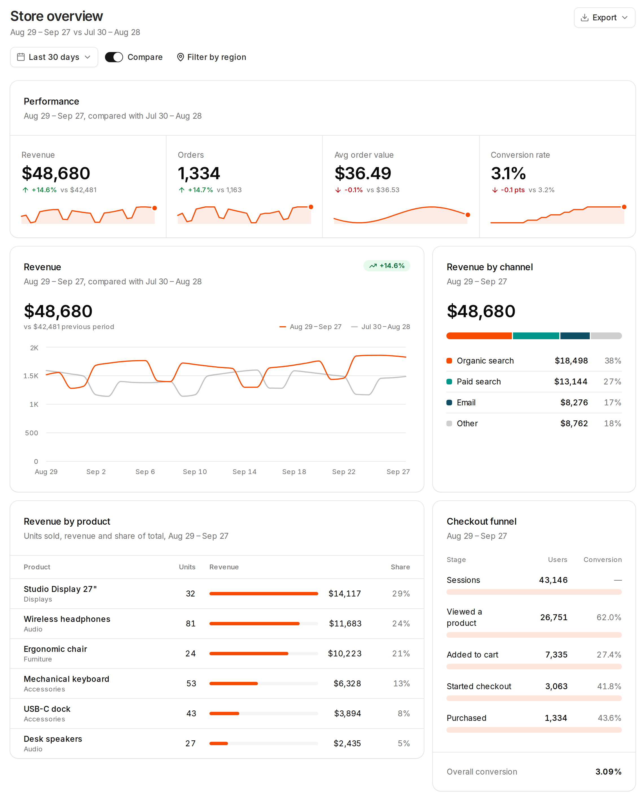

# Dashboardblocks

Dashboardblocks is a set of open-source dashboard blocks built on [shadcn/ui](https://ui.shadcn.com). The shadcn CLI copies each block's source into your project, so you add only the blocks you use and can edit every line.

<picture>
  <source media="(prefers-color-scheme: dark)" srcset=".github/assets/store-dark.png">
  
</picture>

## Installation

Install any block with the shadcn CLI:

```bash
npx shadcn@latest add @dashboardblocks/kpi-01
```

Or install a full dashboard:

```bash
npx shadcn@latest add @dashboardblocks/dashboard-01
```

`@dashboardblocks` is listed in the [shadcn registry directory](https://ui.shadcn.com/docs/directory), so there's nothing to set up. The CLI picks the build for your component library (Base UI, Radix UI or React Aria), and blocks work with every shadcn/create style and icon library. See [Compatibility](https://www.dashboardblocks.com/docs/compatibility).

## Documentation

Visit https://www.dashboardblocks.com/docs to browse all blocks and view the documentation.

## License

Licensed under the [MIT license](https://github.com/LGLabGreg/dashboardblocks/blob/main/LICENSE.md).
